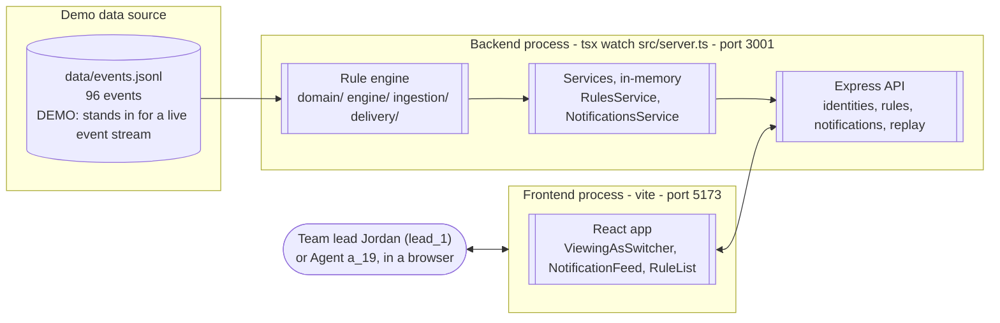
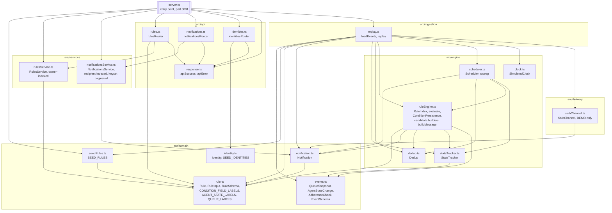
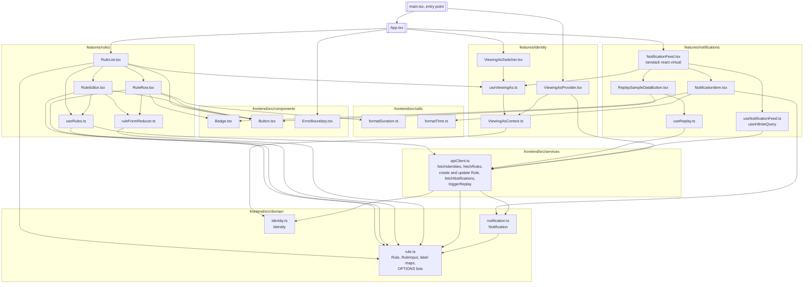
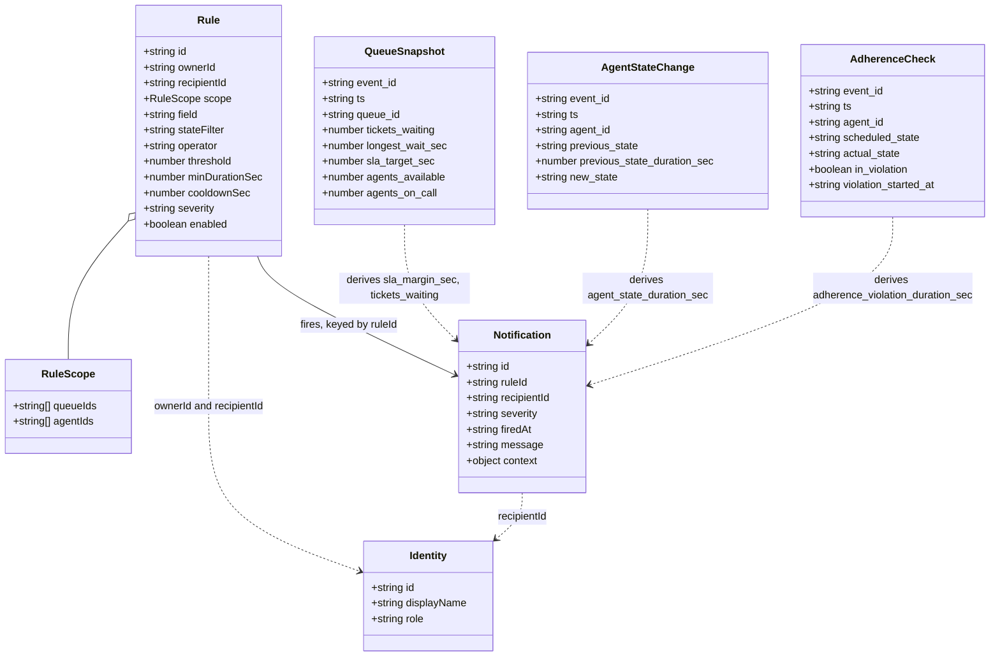
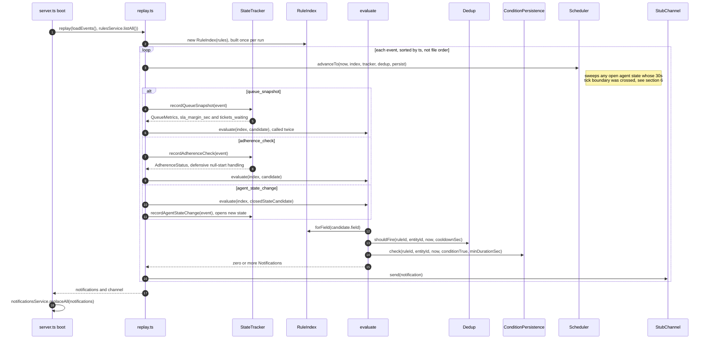
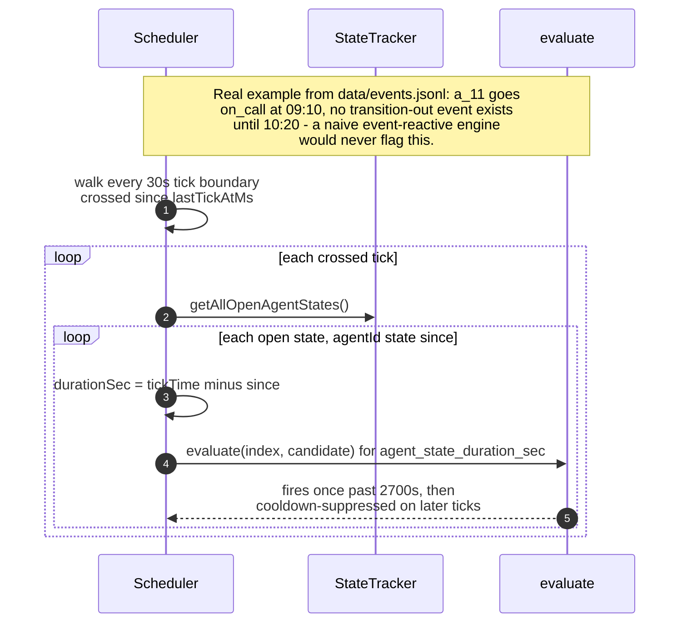
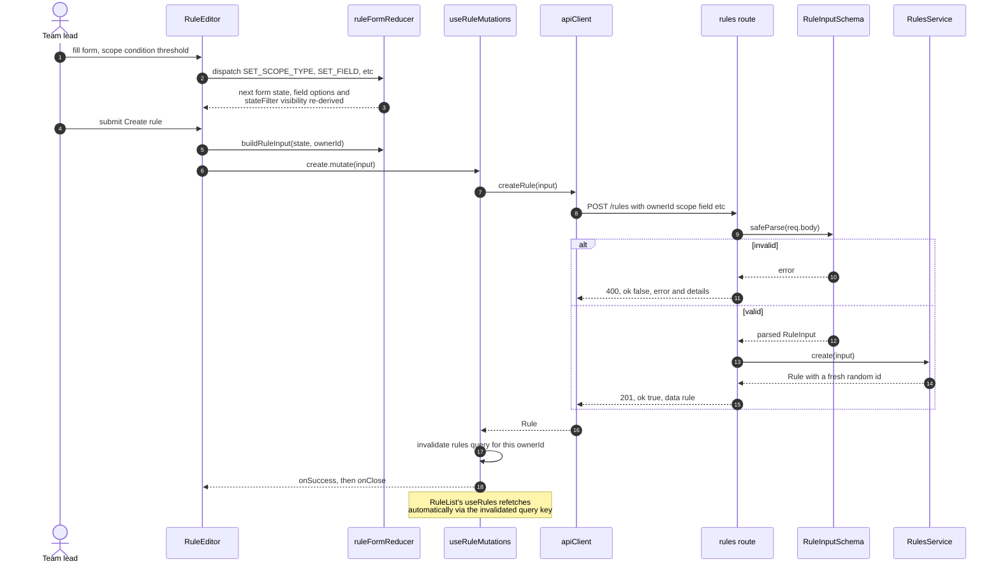
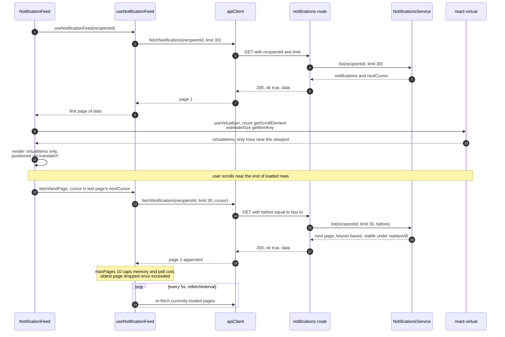

# Architecture

Detailed reference diagrams for the whole system — backend and frontend,
module by module, plus the data flows that tie them together. This is a
deep-dive companion to `README.md`'s higher-level architecture section
(§2); that one's written for the 30-minute review narrative, this one's
written to be exhaustive. Every node/edge below is a real import or call
site as of this writing, not an idealized sketch — see the file paths named
throughout if you want to check any single edge against the code.

## Contents

1. [System overview](#1-system-overview)
2. [Backend module graph](#2-backend-module-graph)
3. [Frontend module graph](#3-frontend-module-graph)
4. [Domain model](#4-domain-model)
5. [Sequence: replay boot → event-driven notification](#5-sequence-replay-boot--event-driven-notification)
6. [Sequence: scheduler catches an in-progress duration breach](#6-sequence-scheduler-catches-an-in-progress-duration-breach)
7. [Sequence: creating a rule via the UI](#7-sequence-creating-a-rule-via-the-ui)
8. [Sequence: notification feed — pagination + virtualization](#8-sequence-notification-feed--pagination--virtualization)

---

## 1. System overview

Two independent processes, no shared runtime — the frontend only ever
talks to the backend over HTTP (dev-only CORS, any `localhost:<port>`
origin; see `src/server.ts`).

## 2. Backend module graph

Every arrow is a real `import` edge (verified against the source, not
inferred). Grouped by directory to match the actual folder structure.

## 3. Frontend module graph

Rooted at `frontend/src/`, per `react-typescript-best-practices/SKILL.md`'s
Code Organization section. Domain types here are a deliberate duplicate of
the backend's (see `frontend/src/domain/rule.ts`'s header comment), not an
import across the process boundary.

## 4. Domain model

Fields not shown as plain `string`/`number`/`boolean` above but worth
calling out explicitly:

- `Rule.field` is `ConditionField` = `sla_margin_sec | tickets_waiting |
  adherence_violation_duration_sec | agent_state_duration_sec`.
- `Rule.operator` is `Operator` = `> | >= | =`.
- `Rule.severity` and `Notification.severity` are `Severity` = `warning |
  danger`.
- `Identity.role` is `'team_lead' | 'agent'`.
- `Rule.stateFilter`, `Rule.minDurationSec`, `AgentStateChange.previous_state`,
  `AgentStateChange.previous_state_duration_sec`, and
  `AdherenceCheck.violation_started_at` are all optional/nullable — see
  `src/domain/rule.ts` and `src/domain/events.ts` for the exact Zod schemas.

## 5. Sequence: replay boot → event-driven notification

## 6. Sequence: scheduler catches an in-progress duration breach

The single most important design decision in the system (see README §3) —
`agent_state_change` fires only on transition, so a rule like "on a call
over 45 min" needs this sweep to catch it while still happening.

## 7. Sequence: creating a rule via the UI

## 8. Sequence: notification feed — pagination + virtualization

